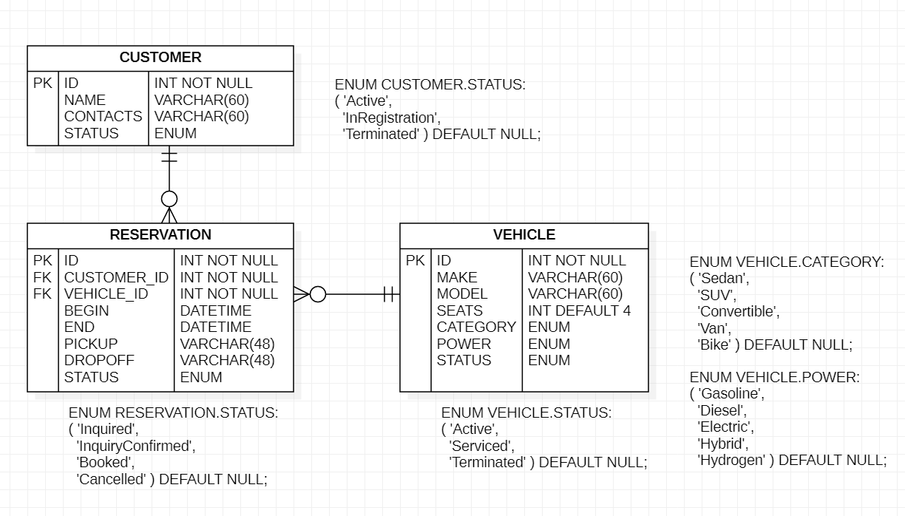

# db-freerider

Assignments for *Software Engineering-II* for building a *mysql* database server
with database `db_freerider`:

- Ue DB1: [DB-Server Build with Docker](markup/Ue_DB1_Server_Build.md).

- Ue DB2: [Schema- and Data-Build, Queries](markup/Ue_DB2_Schema_Data_Build.md).

The Datamodel of the `db_freerider` database as ER-Diagram:

