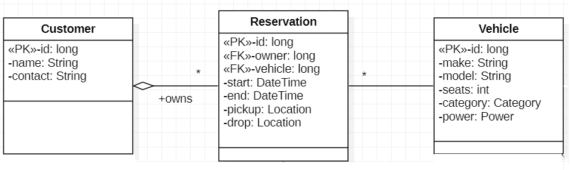
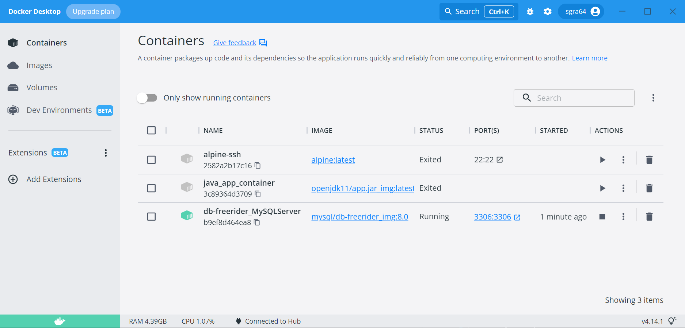
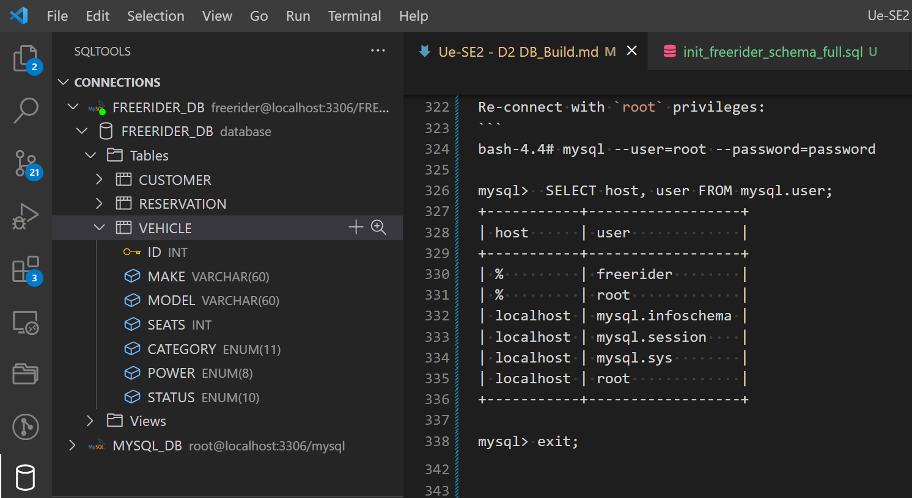
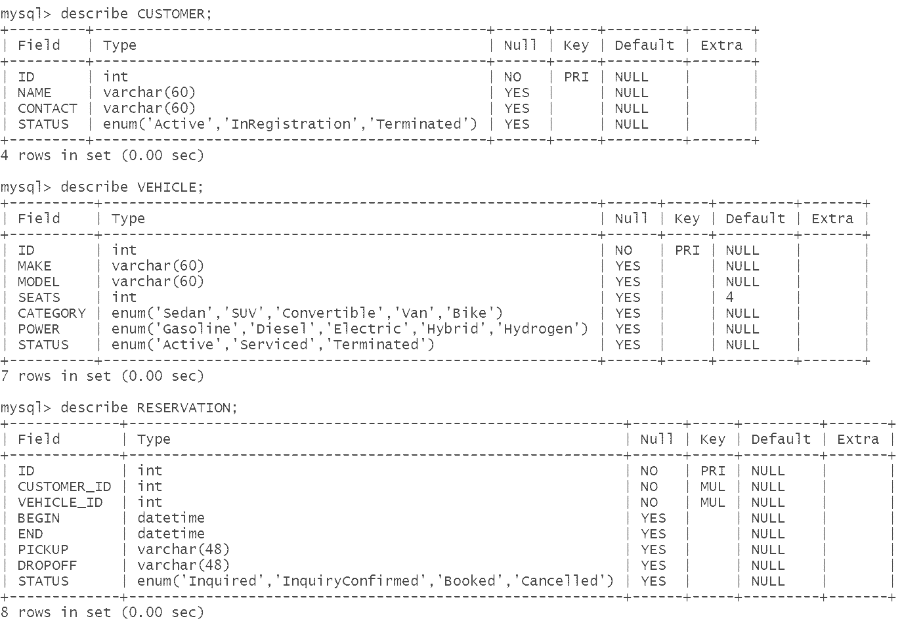

## Übung DB1: DB-Server Build with Docker &nbsp; (12 Pts)

&nbsp;

[MySQL](https://www.mysql.com) is a popular open source
( [src](https://github.com/mysql/mysql-server) )
Relational DataBase Management System (RDBMS) taking the #2 spot
of installed database servers worldwide, after Oracle's Database
([source](https://www.c-sharpcorner.com/article/what-is-the-most-popular-database-in-the-world)).

- MySQL is a full-fledged relational Database that fully supports
[ACID](https://www.geeksforgeeks.org/acid-properties-in-dbms) properties,
in contrast to most non-relational database systems.

- MySQL is a client-server database with a client `mysql` (CLI) or a connector
package for an application programm communicating over a network to the
database server `mysqld` (daemon process) on TCP port 3306 (default).

- The database server `mysqld` can reside on a different machine than the client
or inside a container or a virtual machine.

Goal of this assignment is to build the database for a car sharing application
*freerider* from a datamodel that is suitable for managing reservations:

Data-model for `FREERIDER_DB`:
<!--  -->


- Type `Location` is a `String` for pickup or drop location.

- Type `Category` of cars is
    `Enum: ['Sedan', 'SUV', 'Convertible', 'Van', 'Bike']`.

- Type `Power` of cars is
    `Enum: ['Gasoline', 'Diesel', 'Electric', 'Hybrid', 'Hydrogen']`.


---
### Challenges
1. [Challenge 1:](#1-challenge-1) Create DB project structure (scaffolding) - (2 Pts)
2. [Challenge 2:](#2-challenge-2) Build DB container - (3 Pts)
3. [Challenge 3:](#3-challenge-3) DB Schema (Customer, Vehicle, Reservation) - (1 Pt)
4. [Challenge 4:](#4-challenge-4) Complete and Load Schema into DB - (2 Pts)
5. [Challenge 5:](#5-challenge-5) Load Data into DB - (1 Pts)
6. [Challenge 6:](#6-challenge-6) Run DB Query - (1 Pts)
7. [Challenge 7:](#7-challenge-7) Delete and rebuild DB from scratch - (2 Pts)

Refer to [known issues](https://github.com/sgra64/db-freerider/blob/main/Known_Issues.md)
for problems.


&nbsp;

---
Building a database has the following steps:

1. Create the DB environment with:
    - a database *build project*,
    - *external storage* (DB data always reside outside the container, here
      in a volume `./db.mnt/db-data` mounted from the host system),
    - *TCP port* (default for MySQL: 3306) under which the DB-Server can be
      accessed by client tools such as `mysql` or a db-connector library
      such as `JDBC`.

1. Install the database and create the running DB instance
    *[mysqld](https://dev.mysql.com/doc/refman/8.0/en/mysqld.html)* :
    - build new container image: `mysql/db-freerider_img:8.0`
        based on base-image [mysql:8.0](https://hub.docker.com/_/mysql).
    - create new container: `db-freerider_MySQLServer` based on the
        new image.
    - start the container (with the *mysqld* DB Server running inside).

1. Create the database in the running DB Server:
    - `CREATE DATABASE FREERIDER_DB;`

1. Create the schema for the new database:
    - `CREATE TABLE CUSTOMER ... ;`
    - `CREATE TABLE VEHICLE ... ;`
    - `CREATE TABLE RESERVATION ... ;`

1. Load the schema into database `FREERIDER_DB`.

1. Load data into database `FREERIDER_DB`.


&nbsp;
---
### 1.) Challenge 1

This step creates the structure for the DB project.
Databases "need to be build" like any software. 

Create the structure (scaffold) for project `db-freerider`:

```
--<db-freerider>:           <-- new database build project
 |
 +--.env.sh                 <-- project .env file to source shell: source .env.sh
 +--.gitignore              <-- git .gitignore file
 +--Dockerfile              <-- Dockerfile to build MySQL-image
 +--docker-compose.yaml     <-- Compose file for container lifecycle
 |
 +--<db.mnt>:               <-- directory mounted inside the container under: /mnt
 |    +--.env.sh            <-- container .env file, source with: source /mnt/.env.sh 
 |    +--my.cnf             <-- mysqld config file (linked to /etc/mysql/conf.d/my.cnf)
 |    +--shutdown.sh        <-- mysqld shutdown script
 |    |
 |    +--init_freerider_schema.sql  <-- DB init files (schema)
 |    +--init_freerider_data.sql    <-- DB init files (data)
 |    +--init_users.sql             <-- DB init files (users, remote access)
 |    |
 |    +--data_customers.sql         <-- DB full dataset (customers)
 |    +--data_reservations.sql      <-- DB full dataset (reservations)
 |    +--data_vehicles.sql          <-- DB full dataset (vehicles)
 |    |
 |    +--db_data            <-- mysqld database files (residing in host fs)
 |    |    +--.touch        <-- empty file to commit empty db_data directory
 |    |    |
 |    |    +--FREERIDER_DB  <-- later: mysqld FREERIDER_DB files
 |    |
 |    +--db_logs            <-- mysqld log files (mounted to /var/log/mysql)
 |    |    +--.touch        <-- empty file to commit empty db_logs directory
 |    |
```
1. Create the project directory `db-freerider` and copy files .gitignore,
    Dockerfile, docker-compose.yaml into the directory.

1. Create the `db.mnt` directory and copy files my.cnf, init_*.sql
    into that directory.

1. Create the `db_data` directory in `db.mnt` and create an empty
    file `.touch` inside (don't create FREERIDER_DB).

1. Also create `db_logs` directory with emtpy file `.touch` inside.

Verify the result:

```
cd db-freerider
find .
```

Output:

```
.
./.env.sh
./db.mnt
./db.mnt/.env.sh
./db.mnt/data_customers.sql         <-- DB full dataset (customers)
./db.mnt/data_reservations.sql      <-- DB full dataset (reservations)
./db.mnt/data_vehicles.sql          <-- DB full dataset (vehicles)
./db.mnt/db_data
./db.mnt/db_data/.touch
./db.mnt/db_logs
./db.mnt/db_logs/.touch
./db.mnt/init_freerider_data.sql
./db.mnt/init_freerider_schema.sql
./db.mnt/init_users.sql
./db.mnt/my.cnf
./docker-compose.yaml
./Dockerfile
```

The directory `./db.mnt` in the project directory (on the host system) is *"mounted"*
as volume into the container under the path `/mnt`. It means, all files under `./db.mnt`
are available inside the container under path `/mnt`.

The picture from lecture shows the relation between the host system (laptop) and the
database container.

<!--  -->


(2 Pts)


&nbsp;
---
### 2.) Challenge 2

The container for the MySQL database server is built from the
[mysql:8.0](https://github.com/docker-library/mysql/blob/e0d43b2a29867c5b7d5c01a8fea30a086861df2b/8.0/Dockerfile.oracle)
base image.

The new image will be called: `mysql/db-freerider_img:8.0`
and the new container: `db-freerider_MySQLServer`.
Names are stored in shell-variables that are *"sourced"* from the
project `.env.sh` file. Using *.env*-files has become popular to set
project-specific variables and functions (customized shell commands).

Source the project:

```perl
cd <project_directory>

# show project definitions in project .env file
cat .env.sh

# source the project (with env vars: project_path, image_name, container_name)
source .env.sh

# show variable values
echo ${project_path}
echo ${image_name}
echo ${container_name}
```

Output:

```sh
/c/svgr/workspaces/2-SE/db-freerider    # path to project on your laptop
mysql/db-freerider_img:8.0              # image_name
db-freerider_MySQLServer                # container_name
```

Make sure environment variables have been set **BEFORE** building the image.

**Step 1: Building the image**

using `Dockerfile` (must be in same directory):

Mac's with M1 Chip need to use `FROM --platform=linux/amd64 mysql:8.0`
in Dockerfile, see:
*"Choosing the right Docker Image for your Apple M1 Pro"*,
[link](https://collabnix.com/choosing-the-right-docker-image-for-your-apple-m1-pro).


```py
echo "building image: ${image_name}"
docker build -t "${image_name}" --no-cache .    # . use Dockerfile here
```

Output:

```
building image: mysql/db-freerider_img:8.0
[+] Building 2.9s (14/14) FINISHED
 => [internal] load build definition from Dockerfile                       0.0s
 => => transferring dockerfile: 2.01kB                                     0.0s
 => [internal] load .dockerignore                                          0.0s
 => => transferring context: 2B                                            0.0s
 => [internal] load metadata for docker.io/library/mysql:8.0               0.0s
 => [internal] load build context                                          0.0s
 => => transferring context: 127B                                          0.0s
 => CACHED [1/9] FROM docker.io/library/mysql:8.0                          0.0s
 => [2/9] RUN ln -s /mnt/my.cnf /etc/mysql/conf.d/my.cnf                   0.3s
 => [3/9] RUN touch /docker-entrypoint-initdb.d/db_init.sql                0.4s
 => [4/9] ADD ./db.mnt/init_freerider_schema.sql /tmp/init_schema.sql      0.1s
 => [5/9] ADD ./db.mnt/init_freerider_data.sql /tmp/init_data.sql          0.1s
 => [6/9] RUN cat /tmp/init_schema.sql >> /docker-entrypoint-initdb.d/db_  0.3s
 => [7/9] RUN cat /tmp/init_data.sql >> /docker-entrypoint-initdb.d/db_in  0.3s
 => [8/9] RUN ln -s /mnt/db_data /var/lib/mysql                            0.4s
 => [9/9] RUN ln -s /mnt/db_logs /var/log/mysql                            0.3s
 => exporting to image                                                     0.5s
 => => exporting layers                                                    0.4s
 => => writing image sha256:585cebeb926503843875e634a3425d2d8f7989478bd25  0.0s
 => => naming to docker.io/mysql/db-freerider_img:8.0                      0.0s
```

**Step 2: Creating the container**

requires passing variables with passwords and exposing the internal port 3306
to the host system.

Another part is mounting the directory: `db.mnt` (in the project directory)
to a path inside the container: `/mnt`. This means that all files under
`./db.mnt` (on the host system) are accessible inside the container under
the path `/mnt`.

**IMPORTANT:**

Mount points must be enabled by the host system. With Docker Desktop, open:

`- Settings -> Resources -> File sharing` -- add host path as sharable mount point

`- Apply & Restart`.

The full docker command for creating the container is:

```sh
docker run \
    --name="${container_name}" \
    \
    --env MYSQL_DATABASE="FREERIDER_DB" \
    --env MYSQL_USER="freerider" \
    --env MYSQL_PASSWORD="free.ride" \
    --env MYSQL_ROOT_PASSWORD="password" \
    \
    --publish 3306:3306 \
    --mount type=bind,src="${project_path}/db.mnt",dst="/mnt" \
    -d "${image_name}"
```

Docker Desktop will display the new, running container (green box):

<!--  -->


**IMPORTANT:**

While the container has been created and started (with `docker run`), the
database server process *mysqld* needs to complete the initialization
process before it can be used.

Wait for *mysqld* to finish the setup phase.

Wait for log-lines from container:

```perl
# show container logs
docker logs "${container_name}"

# alternatively, use 'dock' shortcut command from .env.sh
dock logs
```

Output (ignore Warnings):

```
docker logs "db-freerider_MySQLServer"
2022-12-12 20:06:19+00:00 [Note] [Entrypoint]: Entrypoint script for MySQL Server 8.0.31-1.el8 started.
...
2022-12-12 20:06:20+00:00 [Note] [Entrypoint]: Initializing database files
2022-12-12 20:06:37+00:00 [Note] [Entrypoint]: Database files initialized
2022-12-12 20:06:37+00:00 [Note] [Entrypoint]: Starting temporary server
2022-12-12 20:06:45+00:00 [Note] [Entrypoint]: Temporary server started.
'/var/lib/mysql/mysql.sock' -> '/var/run/mysqld/mysqld.sock'
...
2022-12-12 20:06:52+00:00 [Note] [Entrypoint]: Creating database "FREERIDER_DB"
2022-12-12 20:06:52+00:00 [Note] [Entrypoint]: Creating user "freerider"
2022-12-12 20:06:52+00:00 [Note] [Entrypoint]: Giving user "freerider" access to schema "FREERIDER_DB"

2022-12-12 20:06:52+00:00 [Note] [Entrypoint]: /usr/local/bin/docker-entrypoint.sh: running /docker-entrypoint-initdb.d/db_init.sql

2022-12-12 20:06:53+00:00 [Note] [Entrypoint]: Stopping temporary server
2022-12-12 20:06:55+00:00 [Note] [Entrypoint]: Temporary server stopped

2022-12-12 20:06:55+00:00 [Note] [Entrypoint]: MySQL init process done. Ready for start up.
```

Wait for: `MySQL init process done. Ready for start up`.

Show the running MySQL container:

```sh
docker ps
CONTAINER ID   IMAGE                        COMMAND                  CREATED
      STATUS          PORTS                               NAMES
b9ef8d464ea8   mysql/db-freerider_img:8.0   "docker-entrypoint.s…"   56 minutes
ago   Up 56 minutes   0.0.0.0:3306->3306/tcp, 33060/tcp   db-freerider_MySQLServ
er
```

Show the running `mysqld` database server inside the MySQL container:

```
docker top "${container_name}"
UID                 PID                 PPID                C
STIME               TTY                 TIME                CMD
999                 13492               13466               2
21:44               ?                   00:00:07            mysqld    <--
root                13785               13466               0
21:48               ?                   00:00:00            /bin/sh
```

With the running database server, a `mysql` client can connect from
either the host system (if you have a mysql client installed on your laptop)
or from within the container by attaching a bash shell:

```
dock bash               # using 'dock' command from .env.sh
                        # or with full docker command:
docker exec -it "${container_name}" /bin/bash

bash-4.4#                # bash running inside the container
bash-4.4# ls -la         # show file system inside the container
```

The database server process `mysqld` needs to be shutdown gracefully in order
to avoid data corruption. The SQL-shutdown statement can be used to shut down
the database server:

```sql
mysql> shutdown;
```

In order to also end the container, the `dock` command from `.env.sh` can be
used:

```
dock stop           # shut down mysqld gracefully and stop container
dock start          # restart the container and mysqld server process
```

When the container and the `mysqld` - server process within the container are running,
the `mysql` - client can connect:

```
bash-4.4# mysql --user=freerider --password=free.ride

Your MySQL connection id is 11
Server version: 8.0.31 MySQL Community Server - GPL

Copyright (c) 2000, 2022, Oracle and/or its affiliates.

Oracle is a registered trademark of Oracle Corporation and/or its
affiliates. Other names may be trademarks of their respective
owners.

Type 'help;' or '\h' for help. Type '\c' to clear the current input statement.

mysql>
```

when the client is connected to the server, SQL commands can be entered:

```
mysql> show databases;
+--------------------+
| Database           |
+--------------------+
| FREERIDER_DB       |
| information_schema |
| performance_schema |
+--------------------+

mysql> use FREERIDER_DB;
Database changed

mysql> show tables;
+------------------------+
| Tables_in_freerider_db |
+------------------------+
| CUSTOMER               |
| RESERVATION            |
| VEHICLE                |
+------------------------+

mysql> exit;
Bye
bash-4.4#
```

Re-connect with `root` privileges:

```
bash-4.4# mysql --user=root --password=password

mysql>  SELECT host, user FROM mysql.user;
+-----------+------------------+
| host      | user             |
+-----------+------------------+
| %         | freerider        |
| %         | root             |
| localhost | mysql.infoschema |
| localhost | mysql.session    |
| localhost | mysql.sys        |
| localhost | root             |
+-----------+------------------+

mysql> exit;
Bye
bash-4.4#
```

(2 Pts)


&nbsp;
---
### 3.) Challenge 3

The datamodel for the *freerider* reservation system needs to be mapped
to a database model, which is shown as Entity-Relationship ER-Diagram
(ERD, [link](https://www.lucidchart.com/pages/er-diagrams) )
below for entity types: `Customer`, `Vehicle` and for the relationship
type `Reservation` representing the reservation relation between a CUSTOMER
and a VEHICLE with two FOREIGN KEY (FK) attributes: `CUSTOMER_ID` and
`VEHICLE_ID`.

<!--  -->


[./db.mnt/init_freerider_schema.sql](https://github.com/sgra64/db-freerider/blob/main/db.mnt/init_freerider_schema.sql) contains the `SQL-Schema`,
which starts with removing the old schema (and data) from the database
before creating the new schema:

```sql
DROP SCHEMA IF EXISTS FREERIDER_DB;

CREATE SCHEMA IF NOT EXISTS FREERIDER_DB;
USE FREERIDER_DB;

DROP TABLE IF EXISTS CUSTOMER;
CREATE TABLE CUSTOMER (
  ID INT NOT NULL,
  NAME VARCHAR(60) DEFAULT NULL,
  CONTACT VARCHAR(60) DEFAULT NULL,
  STATUS ENUM('Active', 'InRegistration', 'Terminated') DEFAULT NULL,
  PRIMARY KEY (ID)
);
...
```

When the database does not exist, MySQL will load the schema from the
`init_freerider_schema.sql` file into the database creating all tables.

(1 Pt)


&nbsp;
---
### 4.) Challenge 4

The schema file is available inside the container under the
mount path: `/mnt/init_freerider_schema.sql`.

The schema file can be loaded into the database (replacing the
prior schema) through the *mysql* - client:

```
bash-4.4# cat /mnt/init_freerider_schema.sql        # <-- show schema

# pipe schema into the database (via mysql client):
#
bash-4.4# cat /mnt/init_freerider_schema.sql | mysql --user=root --password=password
```

Complete `init_freerider_schema.sql` to include all attributes as
shown in the ER-Diagram and load into the database.

The Database tables will then show all attributes.

IDE support database connectivity by plugins. For Visual Studio Code,
the extension [SQLTools](https://marketplace.visualstudio.com/items?itemName=mtxr.sqltools) can be added. The picture show an open connection
to the FREERIDER_DB with created tables (installation of an IDE plugin is
recommended, but not required).

<!--  -->


The loaded database schema can be displayed with SQL:

```
mysql> describe CUSTOMER;
mysql> describe VEHICLE;
mysql> describe RESERVATION;
```

<!--  -->


(3 Pts)


&nbsp;
---
### 5.) Challenge 5

Loading data into the database can be done by the SQL
[INSERT INTO](https://www.w3schools.com/sql/sql_insert.asp) statement:

```sql
USE FREERIDER_DB;

DELETE FROM CUSTOMER;

INSERT INTO CUSTOMER (ID, NAME, CONTACT, STATUS) VALUES
    (1, 'Meyer, Eric', 'eme22@gmail.com', 'Active'),
    (2, 'Sommer, Tina', '030 22458 29425', 'Active'),
    (3, 'Schulze, Tim', '+49 171 2358124', 'Active')
;
```

Add data to file `init_freerider_data.sql` in the project's `db.mnt` directory
and pipe into the database:

```
cat /mnt/init_freerider_data.sql | mysql --user=freerider --password=free.ride
```

(1 Pt)


&nbsp;
---
### 6.) Challenge 6

Execute DB Queries:

```
bash-4.4# mysql --user=freerider --password=free.ride
mysql> use FREERIDER_DB;
mysql> select * from CUSTOMER;
+----+--------------+-----------------+--------+
| ID | NAME         | CONTACT         | STATUS |
+----+--------------+-----------------+--------+
|  1 | Meyer, Eric  | eme22@gmail.com | Active |
|  2 | Sommer, Tina | 030 22458 29425 | Active |
|  3 | Schulze, Tim | +49 171 2358124 | Active |
+----+--------------+-----------------+--------+
3 rows in set (0.01 sec)

```

(1 Pt)


&nbsp;
---
### 7.) Challenge 7

Delete and rebuild MySQL-container from scratch.

(2 Pts)

